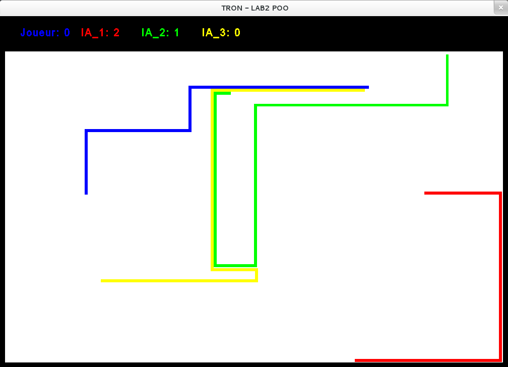

# Tron Light Cycle

#### Groupe : Davy TAPSOBA, Corentin RAOULT, Sylvain KUOCH

Clone du jeu d'arcade réalisé lors du TP 3 de POO à l'UQAC.

### Présentation :

Ce laboratoire a pour but de développer un jeu TRON comprenant 4 motos: 3 IA différentes et un joueur.
La partie graphique à été développé grâce à la librairie awt fournie par java.
La gestion des collisions se fait avec les couleurs. En effet on choisit un fond blanc, et on vérifit si les pixels devant
 la moto sont ne sont pas blanc (bord du terrain, autre moto ou elle-même) alors il y a collision et la moto a perdu.  
Pour bouger les motos on affiche des carrées de coouleurs correspondant à la moto sans effacer les anciens cela permert de garder la trace de la motos.
Les IA héritent de la classe GameEntity, la seule différence avec la classe parente est qu'on a ajouter une méthode pour décider quelle direction doit prendre la moto.
La classe principale TRonGame hérite de  JPanel (pour l'interface graphique) et utilise les intrefaces KeyListener, ActionListener pour la gestion des inputs. 

### Comportement des IAs

#### IA_1:
C'est l'IA la moins intelligente, elle regarde si au coup suivant elle sera en collision. Si oui elle tourne, sinon elle continue dans la même direction.

#### IA_2:
Cette IA change de choisit sa direction aléatoirement (comme l'IA-1) mais sans forcément être en collision.

##### IA_3:
Cette IA essaye de suivre le joueur ou une des autre IA si ce-dernier est mort.

Au final aucume IA n'est très dure à battre.

### Screenshot

